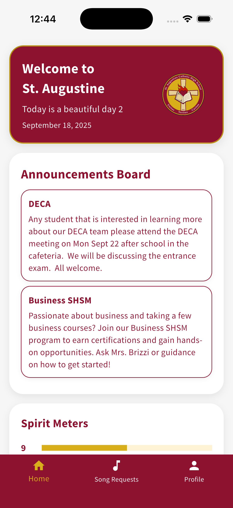

# STA App 2025

A Flutter app for the STA community built for the 2025-2026 school year. It provides announcements, song requests, and a simple profile experience with Google Sign-In restricted to YCDSB accounts.

## Features

- Announcements feed (home block)
- Song Requests with client-side profanity filtering
- Google Sign-In (restricted to `ycdsb.ca` and `ycdsbk12.ca` domains)
- Profile page with sign-out
- Consistent, token-based theming and custom fonts

Key code areas:

- `lib/main.dart` – App entry and routing
- `lib/styles.dart` and `lib/theme.dart` – Design tokens and `ThemeData`
- `lib/auth.dart` – Google Sign-In and domain restrictions
- `lib/widgets/homeblocks/announcements_block.dart` – Announcements UI
- `lib/songrequests.dart` – Song Requests UI and validators
- `lib/profile.dart` – Profile UI and logout
- `lib/consts.dart` – Profanity list and helpers (client-side UX only)

## Screenshots

| Home Screen |
| --- |
|  |

## Prerequisites

- Flutter SDK installed (Dart >= 3.9 as per `pubspec.yaml`)
- Platform tooling as needed:
	- Android: Android Studio + SDK, a device/emulator
	- iOS/macOS: Xcode + command line tools, a device/simulator
	- Web: A modern browser
	- Windows/Linux: Appropriate desktop build toolchains

## Setup

1) Fetch dependencies

	 flutter pub get

2) Configure Google Sign-In / Firebase (per your environment)

- If you use Firebase services, place your platform configs (not committed):
	- Android: `android/app/google-services.json`
	- iOS: `ios/Runner/GoogleService-Info.plist`

- For Google Sign-In, ensure OAuth client IDs are created for each platform and the iOS URL scheme is set up in Xcode (Runner > Info > URL Types). Refer to the `google_sign_in` plugin documentation.

3) Domain restriction

The app only allows sign-in with `ycdsb.ca` and `ycdsbk12.ca` emails. This is enforced in `lib/auth.dart` across interactive and silent sign-in flows.

## Run

Start the app on the currently selected device/simulator:

flutter run

Select a different device with `flutter devices` and then `flutter run -d <deviceId>`.

## Build

- Android (APK):

	flutter build apk --release

- Android (App Bundle for Play Store):

	flutter build appbundle --release

- iOS (IPA):

	flutter build ipa --release

	Note: Configure signing in Xcode (team, provisioning). Place `GoogleService-Info.plist` if using Firebase.

- Web:

	flutter build web --release

	Output in `build/web`.

- macOS:

	flutter build macos --release

- Windows:

	flutter build windows --release

- Linux:

	flutter build linux --release

## Profanity filtering

Client-side filtering in `lib/consts.dart` improves form UX (normalization + pattern checks). Treat server-side validation as the source of truth if you add a backend.

## Security and secrets

Sensitive files are ignored by `.gitignore` (e.g., `google-services.json`, `GoogleService-Info.plist`, keystores, provisioning profiles, private keys, `.env`). Do not commit secrets. Rotate any keys if they were ever exposed in history.

## Troubleshooting

- If sign-in is blocked, verify you’re using a `ycdsb.ca` or `ycdsbk12.ca` account and that platform OAuth is correctly configured.
- On iOS, ensure URL Schemes match your reversed client ID for Google Sign-In.
- If builds fail, verify platform toolchains and run `flutter doctor`.

## License

TBD.
